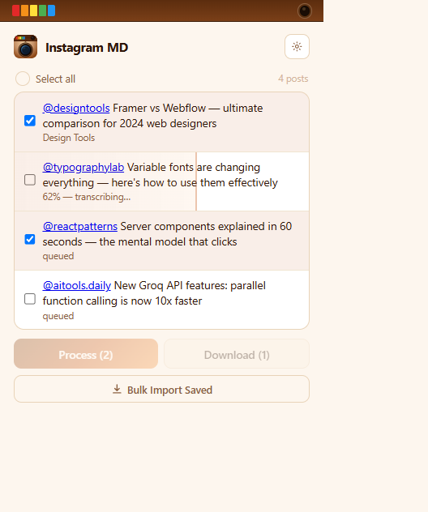
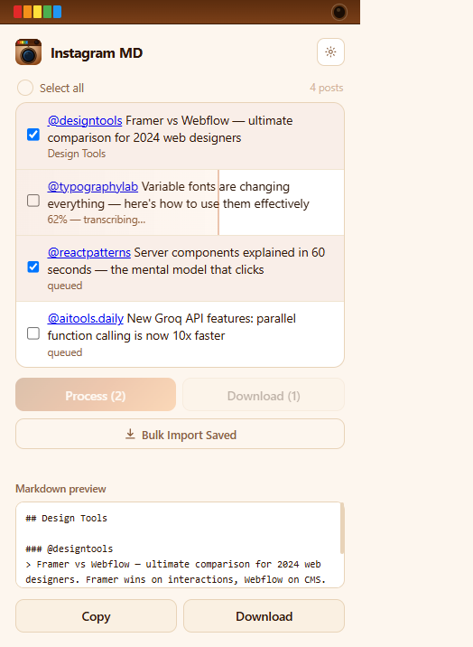
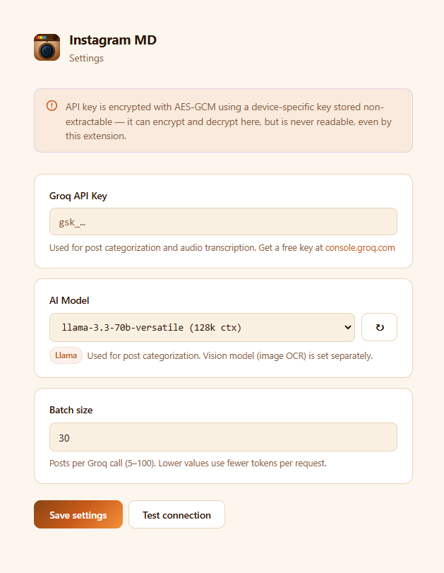

# Instagram MD

A Chrome extension that captures your saved Instagram posts and converts them into an Obsidian-ready markdown note — auto-summarized and categorized by Groq AI.

---

## Screenshots

<table>
  <tr>
    <td align="center"><strong>Post list</strong></td>
    <td align="center"><strong>Markdown preview</strong></td>
    <td align="center"><strong>Settings</strong></td>
  </tr>
  <tr>
    <td></td>
    <td></td>
    <td></td>
  </tr>
</table>

---

## What it does

1. **Capture** — click the save button on any Instagram post (photo, carousel, or Reel) and it's silently added to your queue. Or use **Bulk Import** to scrape your entire saved collection at once.
2. **Process** — select posts and click **Process**. The extension transcribes any Reels via Groq Whisper, runs image OCR on photos/carousels via a vision model, then categorizes and summarizes everything with a Groq chat model.
3. **Download** — get a single Obsidian markdown file, grouped by topic, ready to drop into your vault. Edit the preview in the popup before copying.

### Output format

```markdown
## Design Tools

### Originkit
> Free animated component library for Framer with 50+ ready-to-use components
> #framer #animation #components
> Sep 28, 2026 · @originkit · [View post →](https://instagram.com/...)

### Radix UI
> Unstyled accessible component primitives for React
> #react #accessibility #components
> Sep 27, 2026 · @radix_ui · [View post →](https://instagram.com/...)
```

---

## Requirements

- Chrome (or any Chromium browser)
- A [Groq API key](https://console.groq.com) — free tier is enough for personal use

---

## Installation

1. Clone or download this repo
2. Open `chrome://extensions`
3. Enable **Developer mode** (top right)
4. Click **Load unpacked** and select the project folder
5. Click the extension icon → **Settings** (gear icon)
6. Paste your Groq API key and click **Save settings**
7. Click **Test connection** to confirm the key works — available models load automatically

---

## Usage

### Saving posts as you browse

Navigate to any post or Reel on Instagram and click the bookmark/save icon. The extension captures the post silently in the background — no popup, no interruption.

### Bulk importing saved posts

1. Go to `instagram.com/your_username/saved/all-posts/`
2. Open the extension popup
3. Click **Bulk Import Saved**
4. The extension scrolls through your saved collection and queues everything it finds (deduplicates by URL so re-importing is safe)

### Processing posts

1. Select posts by clicking anywhere on a row (or use **Select all**)
2. Click **Process (n)** — the extension:
   - Transcribes Reels via Groq Whisper (CDN fetch, runs in parallel, no tab navigation)
   - Runs vision OCR on images and carousels (up to 3 images per post)
   - Categorizes and summarizes each post with the configured chat model
3. Processing **continues in the background** even if the popup is closed — each item shows a progress fill as it moves through stages
4. When done, items move to **Done** (green dot) in the unified list

### Reviewing and downloading

- Click **Download (n)** to export selected processed posts as a `.md` file
- The markdown preview appears in the popup after each batch — it's **editable**, so you can trim or adjust before copying
- Edits are auto-saved; closing and reopening the popup restores the last preview
- Processing a second batch **appends** to the existing preview rather than replacing it
- Click **Clear (n)** to remove processed posts from the list

---

## Settings

Open **Settings** (gear icon in the popup) to configure:

| Setting | Description |
|---|---|
| **Groq API Key** | Encrypted with AES-GCM on-device. Re-enter only when rotating keys — leaving blank preserves the existing key. |
| **AI Model** | Fetched live from Groq. Select from all available chat models; context window shown next to each name. Click **↻** to refresh. |
| **Batch size** | Posts per Groq categorization call (5–100). Lower = fewer tokens per request. |

### Models

- **Categorization** — configurable in Settings. Defaults to `llama-3.3-70b-versatile` if none saved.
- **Image OCR** — `meta-llama/llama-4-scout-17b-16e-instruct` (vision model, hardcoded).
- **Transcription** — `whisper-large-v3-turbo` (Groq Whisper, hardcoded).

---

## Privacy

- Posts and transcripts are stored locally in `chrome.storage.local`.
- The API key is encrypted with a device-specific non-extractable key (AES-GCM, Web Crypto API) before storage. The raw key is never written to disk.
- Data leaves the browser only for the Groq API calls you explicitly trigger.
- No analytics, no external servers, no sync.

---

## Project structure

```
manifest.json        Extension config (MV3)
content.js           Runs on instagram.com — save hook + bulk scroll
background.js        Service worker — queue, transcription, image OCR, AI batch
offscreen.js         CDN audio fetch → WAV encoding
ai-providers.js      Groq chat completions (categorization + model list)
popup.js / .html     Extension popup — unified post list, progress, preview
options.js / .html   Settings — API key, model picker, batch size
storage.js           chrome.storage wrapper + partial-update config
encryption.js        Device key generation and AES-GCM encrypt/decrypt
icons/icon.svg       Old Instagram camera logo (source for extension icons)
```
